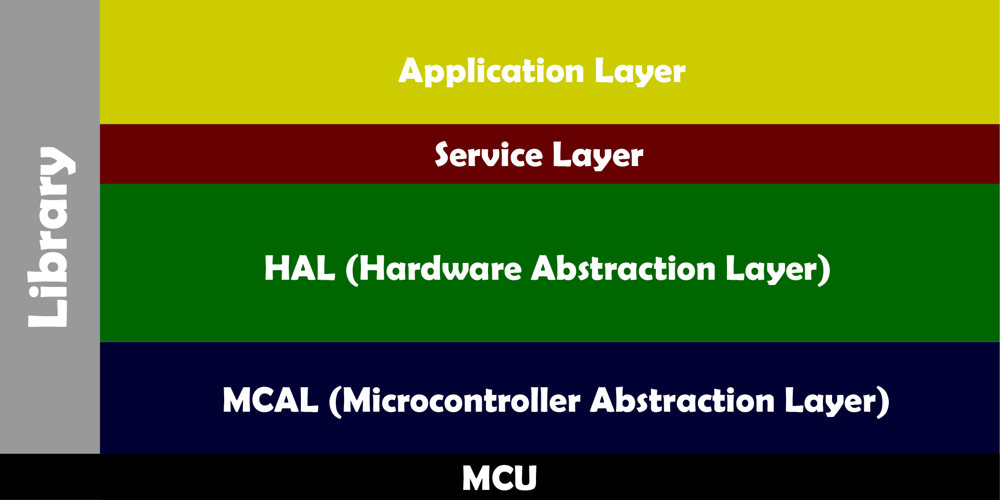
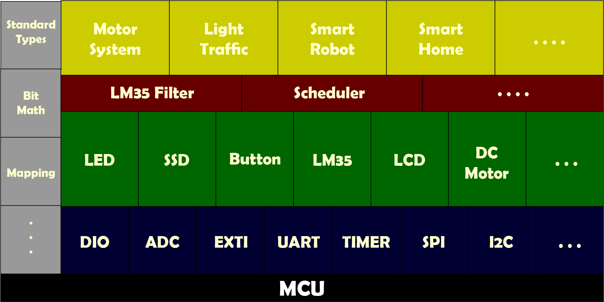

# ES Concept

## About

> ### Year 
>
> Fall 2020
>

> # BY 
>
> ### A. S.  Eldesouky

## Content

1. Introduction to Embedded Systems 
2. Number Systems
3. Digital Logic
4. System Buses
5. Processor
6. Memory
7. Buses Architecture 
8. Introduction to Microcontroller 
9. Software Architecture Layers
10. Drivers Configurations Types
11. Drivers Files 
12. Reference 

*****

## Introduction to Embedded Systems

Nowadays Embedded systems are in everywhere, we found it in every smart device, even in most electrical appliances we find embedded systems, in home, office, car, air conditioner, TV, planes, robotics, literally everywhere


### Machine Systems 

Embedded System is a machine, so let's know what the component of any machine 

1. Processor 

   It's the brain of any machines, because it calculates mathematical operations and execute the information stored in memory

2. Memory 

   Inside any machine there's two types of memory (RAM, ROM), it be used for store the program files and the variables in our program 

3. Peripherals  

   The most famous peripheral is the I/O peripheral, there're more peripherals like Timer, ADC and so on, the function of I/O devices is to provide a means of communicating with the processor


Now let's explain what the types of machines 

- Computing System (General Purpose)

  We use this system when we don't specialize the target of tasks in our machines, like laptops, we use it to playing, browsing, reading, writing, watching, use different applications, therefore we called general purpose, because at the time of selling it we don't know what purpose the user need it for and what he will do on it

  Computing System has some features

  1. High performance processor (Gigahertz)
  2. Very big memory (Gigabyte)
  3. Big size
  4. High cost 
  5. High power consumption 


- Embedded System (Special Purpose)

  We use this system when we have special target of tasks in our machines, like the air conditioner, we use it to adjust the air temperature only, we don't use it to waste our time on Facebook, therefore we called special purpose, because at the time of selling it we know what purpose the user need it for and what he will do on it

  Embedded System has some features

  1. Low performance processor (Kilohertz)
  2. Very small memory (Kilobyte)
  3. Very small size
  4. Low cost 
  5. Low power consumption 


### ES Challenges 

We use Embedded System with limited recourses instead of Computing System because of reason, so let's know it

1. Performance
2. Size
3. Cost 
4. Power Consumption 

This features depends on what you need, like low quality for low cost and big size and so on

### ES Implementations 

There're two types of ES implementation 

1. System Board 
   - Every unit of microcontroller (processor, memory, peripherals) soldered on one board
   - Use wires or tracks to connect to each others 
   - We use it when we need to change any unit of microcontroller with another and we don't sure if all unit are required (Configurability)
2. System On Chip
   - All unit of microcontroller (processor, memory, peripherals) engraved on one chip
   - Use tunnels to connect to each others
   - We use it when we didn't need to change any unit of microcontroller and we make sure of all unit are required

|      Compare      | System Board | System On Chip |
| :---------------: | :----------: | :------------: |
|    Performance    |     Same     |      Same      |
|       Size        |     Big      |     Small      |
|       Cost        |     High     |      Low       |
| Power Consumption |     High     |      Low       |


There're important concept in Embedded Systems we must know about it like number systems, Digital logic, CPU, Memory, Systems architecture, therefore in next sections we'll take about it 

*****

## Number Systems 

Here we will toke about the human numbers '"Decimal" **(base 10)**, machines numbers "Binary" **(base 2)**, also the binary numbers can be represented as hexadecimal **(base 16)**, the binary format of the characters called as **ASCII** 

### Decimal and Binary Number Systems 

Humans have 10 fingers, so they use them to count, but the machine have low and high or (on and off), so they use them to count, now let's know how to convert from decimal to binary and from binary to decimal 

1.  from decimal to binary

   - method 1 

     divide the decimal by 2 repeatedly, then write the remainder until the quotient get 0

     ```pseudocode
     /*	decimal		quotient 		remainder	*/
     	25 / 2 		12				1			LSB (least signficant bit)
     	12 / 2 		6				0
     	6 / 2		3				0
     	3 / 2		1				1
     	1 / 2		0				1			MSB (most signficant bit)
     
     We write MSB first then last thing LSB
     25 = 0b11001
     ```

   - method 2

     by write the decimal numbers of power 2, then subtract the near decimal number from it, then add 1 otherwise add 0 

     ```pseudocode
     /* 	decimal numbers of power 2 	*/
     	1	2	4	8	16	32	64	128	256	1024
     	1	0	0	1	1
     We have number 25, so is less than 32 but bigger than 16, so add 1 at 16, then subtract 25 - 16, now we have 9 is bigger than 8, so add 1 at 8, then subtract 9 - 8, now we have 1 is equal 1, so add 1 at 1  
     MSB (the bigest decimal number of power 2 have value 1)
     LSB (the last number always at 1)
     25 = 0b11001
     ```

2. from binary to decimal 

   - method 1 

     multiply the binary numbers by 2 power it position, then sum the values 

     ```pseudocode
     /*	binary			position 		value	*/
     	1 		*		2^0				1	
     	0 		*		2^1				0
     	0		*		2^2				0
     	1		*		2^3				8
     	1		*		2^4				16
     
     summation of values = 16 + 8 + 1 = 25
     ```

   - method 2

     by write the decimal numbers of power 2, then sum the values has 1

     ```pseudocode
     /* 	decimal numbers of power 2 	*/
     	1	2	4	8	16	32	64	128	256	1024
     	1	0	0	1	1
     summation of values = 16 + 8 + 1 = 25
     ```

### Hexadecimal System 

We use it to be easier for the human to write instead of binary, (100010010110) in binary equal (896H) in hexadecimal

```pseudocode
0	1	2	3	4	5	6	7	8	9	10	11	12	13	14	15	(Decimal)
0	1	2	3	4	5	6	7	8	9	A	B	C	B	E	F	(Hexdeciaml)
```

1. from hex to binary 

   Just we represent every digit from hex to 4 bit from binary 

   ```pseudocode
   5C4A -> 5		C		4		A
   	 -> 0101	1100	0100	1010
   5C4A = 0101110001001010
   ```

2. from binary to hex 

   Just we represent every bit from binary to digit from hex 

   ```pseudocode
   0101110001001010 -> 0101	1100	0100	1010
   	 			-> 5		C		4		A
   0101110001001010 = 5C4A
   ```

3. from hex to decimal  

   - method 1 

     multiply the hex numbers by 16 power it position, then sum the values 

     ```pseudocode
     /*	hex				position 		value	*/
     	A 		*		16^0			10	
     	4 		*		16^1			64
     	C		*		16^2			3072
     	5		*		16^3			20480
     
     summation of values = 5 + 192 + 1024 + 40960 = 23626
     ```

   - method 2

     convert hex to binary, then to decimal 

     ```pseudocode
     /* 	decimal numbers of power 16 	*/
     	5		C		4		A
     	0101	1100	0100	1010
     	.......... COMPLETE ..........
     summation of values must be 23626
     ```

4. from decimal to hex 

   there're two ways, but we use one because it's easier

   1. convert decimal to binary, then to hex
   2. by division and keep tracking the remainder 

   ```pseudocode
   23626 = (101110001001010) 
   ........ Find it ........
   0101 1100 0100 1010	(We added one more zero at the left to mak it 4 bit)
   5	 C	 4	  A
   ```

### Operations

1. Add

   - binary 

     |  A   |  B   | Sum  | Carry |
     | :--: | :--: | :--: | :---: |
     |  0   |  0   |  0   |   0   |
     |  0   |  1   |  1   |   0   |
     |  1   |  0   |  1   |   0   |
     |  1   |  1   |  0   |   1   |

     ```pseudocode
     add 9 & 5
     carry	0010
     9 	-> 	1001
     5 	-> 	0101
     sum  	1110	-> 14
     ```

   - hexadecimal

     Same idea from binary, but the carry is one when the summation of 2 digits bigger than 16 

     ```pseudocode
     5D6A
     	+
     6F9E
     
     LSB -> A + E = 10 + 14 = 24 - 16 = 8 with carry 
         -> 1 + 6 + 9 = 16 - 16 = 0 with carry 
         -> 1 + D + F = 1 + 13 + 15 = 29 - 16 = 13 = D with carry
     MSB -> 1 + 5 + 6 = 12 = C
     
     sum -> CD08
     ```

2. Sub

   - binary

     There're no circuit for subtraction but the computer use the 2's complement representation for subtract 

     1. Get the 1's complement by make all ones zeros and all zeros ones
        1. add 1 to the 1's complement

     ```pseudocode
     5 	-> 0101
     1's	-> 1010
     		  +
     		  1
     2's -> 1011
     ```

     After you get 2's complement you added with number you need to subtract from

     ```pseudocode
     sub 9 & 5
     carry	0010
     9 	-> 	1001
     ~5 	-> 	1011
     sum  	0100	-> 4
     ```

   - hexadecimal

     If the second digit is greatest operand, borrow 16 from the next digit 

     ```ps
     689E
     	-
     5D6A
     
     LSB -> E - A = 14 - 10 = 4 
         -> 9 - 6 = 3 
         -> 8 - D = 16 + 8 - 13 = 11 = B
     MSB -> 5 - 5 = 0
     
     0B34
     ```

     > - If Subtractive less than Subtractive of it, then subtract the bigger from the small one, then add minus sign 
     > - We can make operation on hexadecimal by convert it first to binary then make our operations then convert it again 

### ASCII Code 

As we say, the numbers in machine represented as 0's and 1's, so if we need to represent a character we can do it, until 1960, the ASCII Code (American Standard Code for Information Interchange) was established, they use 7-bits to represents all numbers from 0 to 9, all the English letters (upper & lower cases), many special characters 


*****

## Digital Logic

### Binary Logic 

We say the machines use only 0's and 1's, so how it represent them

There're many representation and it depends on the input or output signal, let's take the most famous representations 

1. TTL 

   

   

2. COMS

   Complementary Metal Oxide Semiconductor 

   

> 1's = HIGH
>
> 0's = LOW

### Logic Gates 


### Buffer 

Buffer is a basic logic gate that passes its input unchanged to its output, its behavior is the opposite of a NOT gate.
The main purpose of buffer is to regenerate the input, usually using a strong high and a strong low, it has one input and one output and the output always equals its input

1. Buffer 

   

2. Tri-State Buffer 

   

### Logic Circuits 

1. Half Adder

   

2. Full Adder

   

   We can built it from Half Adder like that 

   

3. Decoders

   There're too many examples of decoders 

   - 3 to 8 bit decoder 

     

   - 3 bit adder

     

   - Address decoder 

     

4. Flip-flops 

   It's an important component in digital systems, we use it to store the data 

   

   

*****

## System Buses 

In any machine system, the CPU connected with the memory and I/O devices by strips of wire called **bus**, this buses allow the information to transform from unit to another, in every system there's three types of buses 


### Address bus

The memory or the I/O devices to be recognized by the CPU it must have address and it should be unique (the address for one device only), the CPU puts this addresses on the address bus and find it by decoding circuit 

The number of locations in system devices depends on lines in address bus, 3the number of locations equal (2^x), where x is the number of address lines, example, CPU has 8 address lines can provided 256 (2^8) location in memory, so if there's more address lines, it will be more memory locations

The address bus is **unidirectional bus**, it means the processor use it to send address only

- If the processor address bus bigger than the memory address bus, it's valid but we'll have free space 

- If the processor address bus less than the memory address bus, it's not valid but we can use MMU (Memory Management Unit) to solve this issue, we divide the memory into pages that can the processor handle it, and the pages also divided into locations with the real address 

  We'll find some problem when we solve this issue

  1. Extra Hardware (Extra Cost, Extra Size)
  2. Delay of mapping address 
  3. Delay of page switching 

  

### Data bus 

The CPU use this bus to read or write data in any device connected to it

The processing power of the system depends on the size of information the bus can hold at a time, the CPUs data buses provide 8-bit to 64-bit, the higher data buses provided a better speed for the CPU, but more lanes means more cost it means expensive CPU and system, 8-bit means can send or receive 1 byte at a time, 32-bit means 4 bytes at a time

- If the processor data bus bigger than the memory data bus, it'll transform from the memory to the processor continuous times, and this's waste of time 
- If the processor data bus less than the memory data bus, it'll transform from the processor to the memory continuous times, and this's waste of time

### Control bus

the CPU use this bus to provide read or write signal, like asking the if the CPU need to write an info or read info

From the previse explanation, the address bus and the data bus determined the capability of a given CPU and Memory

*****

## Processor

There're three names (processor, microprocessor, CPU), so what's the difference between them 

1. Processor 

   before transistor manufacture the scientists uses the vacuum tube to represent 0's and 1's by sensing the pressure inside the tubes, therefore the computers was very big size

   

2. Microprocessor

   After transistor manufacture the scientists uses the vacuum tube to represent 0's and 1's by applying voltage difference between the base and the emitter, in cutoff mode represent 0, saturation mode represent 1

   

3. CPU

   In machine systems it can be have multiple processors, but there's only one lead the others and we called **Central Processing Unit**

### Inside CPU


We said before the function of CPU is execute the information stored in memory, so first the information will be **fetch** from memory, then **decode** this instruction, then **execute** it, to do this functionality, it need some resources, let's find it 

- ALU unit (Arithmetical Logical Unit)

  It's responsible for provided arithmetical functions like add, subtract, multiply and divide, logical functions like AND, OR, NOT

- Memory unit (Register Bank)

  1. Program Counter, it's responsible for pointing to the address of the next instruction to be execute, after the instructions be executed, the program counter increment to the next instruction address, the program counter is connecting on the address bus to find and fetch the provided instruction, this register called **IP** or **Instruction Pointer**

  2. Instruction Register, it's responsible for holding the instruction after fetch it from memory, this register called **IR**

  3. Accumulator, it's responsible for holding the result after ALU execution, this register called **Acc**

  4. Program State Register, it's responsible for holding the flags, there're many kind of flags, like zero flag, overflow flag, negative flag, carry flag, these flags indicated for last processor in ALU, this register called **PSR**

  5. General Purpose Registers, we use those register to store the data temporarily for ALU, also we can access it to but variable we use it multiple time, this registers called **GPRs**

     > The size of registers depends on CPU

- Control unit

  It's the brain of the CPU, it lead all the operation inside the processor and responsible for Instruction Decoding 

### CPU Functionality

Let's explain it with steps 

1. **IP** register pointing to the instruction we need to fetch
2. **IR** register **fetch** the instruction from memory we need to decode 
3. **ID** **decode** the instruction we need to execute
4. **ALU** **execute** the instruction we need to store 
5. **ACC register **store** the result we need to send it to memory 


> - **Instruction set:** the set of instruction that CPU can understand it and this instructions depends on the CPU, we represented by the operation code **Opcode**, example, basic operation representation
>
>   | Opcode | Operation |
>   | :----: | :-------: |
>   |   00   |    Add    |
>   |   01   |    Sub    |
>   |   10   | Multiply  |
>   |   11   |  divide   |
>
> - **Instruction Format:** the shape of instruction that CPU can differentiate between the instruction set, operand1 and operand2, example, sub 1 from 6
>
>   | Opcode | operand 1 | operand 1 |
>   | :----: | :-------: | :-------: |
>   |   01   |    110    |    001    |
>   | 2 bits |  3 bits   |  3 bits   |

### Instruction Set Architecture 

#### RISC

Reduced Instruction Set Computing

- Few instructions set
- Not complex in Hardware
- 100 to 200 instructions 

#### CISC

Complex Instruction Set Computing

- Many instructions set
- Complex in Hardware
- 1000 to 5000 instructions

|      Compare      | RISC | CISC |
| :---------------: | :--: | :--: |
|    Performance    | Same | Same |
|       Size        | Same | Same |
|       Cost        | Same | Same |
| Power Consumption | Same | Same |

Confusing Right!!!, let's know how...

1.   

   - RISC

     The instruction take along time in decoding, so it take many CPU cycles, example, we have processor without division circuit and we need to divide 6 over 3, so it turned to two time subtractions, and it take two CPU cycles

     Many Instructions, Few time

   - CISC

     The instruction didn't take along time in decoding, but it take many CPU cycles because of complexity of the circuits, example, we have processor with division circuit and we need to divide 6 over 3, it one instruction, but take two CPU cycles

     Few Instructions, Many time

   So now we can say they're almost the same 

2. Size

   Let's remember, the CPU have 3 sections

   1. Control Unit
   2. ALU
   3. Register Bank

   The Register Bank have the same size, but the ALU and Control Unit are different 

   - RISC

     As we say before, RISC has few instructions set, so it has a small ALU, but the Control Unit have a big size because the Instruction Decoding implemented by hardware circuit

     Small ALU, Big ID

   - CISC

     CISC has many instructions set, so it has a big ALU, but the Control Unit have a small size because the Instruction Decoding implemented by software code

     Big ALU, Small ID

   So now we can say they're almost the same 

3. Cost

   - RISC

     The IDE (Toolchain) for this architecture is expensive, because it take a lot of work to convert our Programing Language to Machine Code, therefore the software is very complex 

     Cheap Hardware, Expensive Software

   - CISC

     There're many instructions and it needs many Hardware Circuit to implement, therefore the Hardware is very complex 

     Expensive Hardware, Cheap Software

   So now we can say they're almost the same 

4. Power Consumption

   As we say in performance section, they're taking the same time to be executed, so we can say they're almost the same 

*****

## Memory 

Memory chips has number of locations, each location can hold 1 bit, 4 bit, 8 bit or 16 bit, it's depends on number of data pins on the chip and the number of locations inside the memory chip depends on the number of address pins, the number of locations in the memory always equal 2 to the power of the number of the address pins, so the total number of bits in memory chip is equal the number of locations multiply with the number of data bits per location

| Data Pins (bits) | Address Pins |  Locations  | Memory Size (bits) |
| :--------------: | :----------: | :---------: | :----------------: |
|        1         |      8       | 2^8 = 0.25K |     1 * 0.25K      |
|        4         |      11      |  2^11 = 2K  |    4 * 2K = 8K     |
|        8         |      12      |  2^12 = 4K  |    8 * 4K = 32K    |
|        16        |      16      | 2^16 = 64K  |   16 * 64K = 1M    |
|        1         |      19      | 2^19 = 512K |  1 * 512K = 215K   |
|        4         |      21      |  2^21 = 2M  |    4 * 2M = 8M     |
|        8         |      27      | 2^27 = 128M |   8 * 128M = 1G    |

###  Memory Types & Cells 

1. Volatile Memory 

   This type of memory is lost the data when the power turned off, so we use it as a temporary storage when the program is running the most fames type is RAM (Random Access Memory) or (read/write memory), there're different type of RAM, as SRAM, NV-RAM, DRAM

   In the begging of the computers the Scientists use the vacuum tube to store the data, then they use the capacitors (by testing if the capacitor charged then it's 1, if discharged then it's 0) and transistors (by testing if the transistor in saturation mode then it's 1, if in cut off mode then it's 0)

   

   

   |      Compare      | Memory based on Transistor | Memory based on Capacitor |
   | :---------------: | :------------------------: | :-----------------------: |
   |    Performance    |       HIGH (better)        |            LOW            |
   |       Size        |        LOW (better)        |           HIGH            |
   |       Cost        |            HIGH            |       LOW (better)        |
   | Power Consumption |        LOW (better)        |           HIGH            |

   > - Performance is low in capacitor because of time of charging and discharging, transistor is high because it didn't need time to change the mode of the transistor 
   > - Size is low in transistor because it made of silicon (sand), high in capacitor because it made from dielectric plate between 2 conductive plates 
   > - The transistor manufacturing is expensive compared to making the capacitors
   > - Memory based on capacitor need refreshing circuit to save the data from erasing, because the capacitor it doesn't hold the electrical charge for long time
   > - Use Load & Store command to access 

   > We use the **Memory based on Capacitor** in computing system because the big of memory in this system (usually the memory in range 2 gigabyte to 16 gigabyte)
   >
   > We use the **Memory based on Transistor** in embedded system because the small of memory in this system (usually the memory in range 1 kilobyte to 8 kilobyte)

2. Nonvolatile Memory 

   This type of memory is not lost the data when the power turned off and it can't be change by the user, so we use it to contains programs and information, the most fames type is ROM (Read Only Memory), there're different type of ROM, as PROM, OTP, EPROM, UV-EPROM, EEPROM, Flash EPROM, Mask ROM

   We use **Floating Gate MOSFET** to make nonvolatile memory 

   

   > - Data represented by electrons in the floating gate
   > - Charging the floating gate by applying very high power from the above isolator 
   > - Discharging the floating gate by applying very high power from the bottom isolator 
   > - Data sensed by the voltage difference between source and drain of the MOSFET
   > - If the floating gate was charged, then there's no current passes from source to drain
   > - If the floating gate was discharged, then there's current passes from source to drain
   > - 10^4 electrons to represent 1 bit 
> - Use Read & Write command to access 

   > To charge or discharge we need to very high power for a long time, so the processor use it to read only because he can provide this amount of energy, we the processor use flash driver circuit to write on ROM

### RAM Types 

#### SRAM 

Static RAM, made from flip-flops, so we don't need refreshing circuit, but the cell of flip-flop can hold 1 bit and it made from 6 transistors previously now it made from 4 transistors, they use CMOS technology 


#### NV-RAM

Nonvolatile RAM, it's a combines of RAM and ROM, the processor can read and write to it and when the power turned off the contents are not lost, it have very low power consumption, use internal lithium battery as a backup source, it has an intelligent control circuit to monitor the voltage difference of pins to detect the loss of the power, if the power of pins falls out, the control switch automatically to the lithium battery, the lithium battery is used only when the the external power turned off, this why the NV-RAM is highest price of the RAM type 


#### DRAM 

Dynamic RAM, made from capacitors, so we need refreshing circuit, the capacitor can hold 1 bit, we use it in computing system


### ROM Types 

All ROM memories have 8 bits for data pins

#### PROM and OTP

User-Programable Memory, it can be program one time, also called One Time Programable or burning ROM or Programing ROM, because we burn information into it and can't be change, it made of fuses, every bit have a fuse, it program by blowing the fuses, if the information burned into PROM or OTP was wrong, that must be discarded 


#### EPROM and UV-ROM

Erasable Programable ROM, it's made to allow making changing in the contents of PROM after it's burned, also it called Ultraviolet EPROM, because we erase the data by exposing it with ultraviolet radiation, it takes about 20 min to erase, and we can reprogram it again, 27XX always refers to UV-EPROM, when you need to erase the data you must take it off from the system board, then erase it and reprogram it, then put it again on the the system board


#### EEPROM

Electrical Erasable Programable ROM, it has many advantage over EPROM, such as it can erasure electrically instead of spending 20 min to erase data, EEPROM can select which byte you need to erase instead of erase all content, it can be program on the the system board it doesn't require to remove it, but the price of EEPROM is higher than EPROM, it can be programed 100K to 1M times


#### Flash Memory ROM

Since 1990, Flash ROM become popular because so many advantage:

1. Can be erase the entire contents less than 1 second
2. Divided into blocks and we can erase the data block by block unlike EEPROM byte by byte 
3. Can be programed while it's on the system board 
4. Can be programed 10K times


#### Mask ROM

Not user-Programable Memory, it can be programed by the manufactory, it's use when the needed volume is high and make sure 200% present the contents will not change, because after the data have been finalized it can't never change, if there was an error on the data the entire amount of Mask ROM must be throw away, but the most advantage of the Mask ROM is the cost, because it very cheap compared with other type of ROM 


******

## Buses Architecture 

AS we know before the CPU uses buses to access RAM, ROM and I/O devices, therefore there're many buses architecture for connecting the buses together, let's know more about it 

### Von Neumann

Here the CPU use the same buses to access RAM, ROM and I/O devices

- Data Bus > this architecture slow down the processing speed of the CPU, because if we need to get data from RAM and ROM in the same time the CPU can not handle it and one of them must be wait for the another  
- Address Bus > this architecture will limit the locations that CPU can access, because we have only one address bus for RAM, ROM and I/O devices and if these locations bigger than processor address bus we need extra hardware component (MMU), here we use memory mapped for this address bus and divide it on the three devices (RAM, ROM and I/O devices)
- Cheap and Simple design 


### Harvard 

Here the CPU use the different buses to access RAM, ROM and I/O devices

- Data Bus > this architecture will provide high processing speed of the CPU, because if we need to get data from RAM and ROM in the same time the CPU can handle it
- Address Bus > this architecture will expanded the locations that CPU can access, because we have three address bus for RAM, ROM and I/O devices and, here we use memory mapped in every address bus for all devices (RAM, ROM and I/O devices)
- Expensive and Complex design


### Modified Harvard

Here the CPU use one system bus to access RAM and I/O devices and one system bus to access ROM 

- Data Bus > this architecture will provide Medium processing speed of the CPU, because if we need to get data from RAM and ROM in the same time the CPU can handle it, but if we need to get data from RAM and I/O devices in the same time the CPU can not handle it
- Address Bus > here we use memory mapped in for RAM and I/O devices and memory mapped for ROM 

### Hybrid

Here the CPU has one system bus, but we use **Bus Multiplexer** to use different buses for accessing RAM, ROM and I/O devices

******

## Introduction to Microcontroller 

in ES world there's too many MCU(Micro Controller Unit), also there's many companies produce those MCUs

### MCU Types & Companies 

Here we'll take about famous MCUs for the companies  


1. Intel: 8051
2. Atmel: AVR
3. Micro ship: images, dsPIC
4. Renesas: RL70A, RH850 
5. Freescale: S12
6. NXP
7. ST: STM32F
8. TI (Taxes Instruments): TIVA C

So we have many options to choose, but what we use ? 

### Criteria for Choosing a MCU

1. Choosing MUC that handle your tasks effectively and lower cost 
   - Speed, what the highest speed do you want in your application 
   - Packaging, the package format to handle the size 
   - Power Consumption, this important for battery size and power supply 
   - RAM & ROM size 
   - GPIO & TIMER numbers
   - Cost, lower cost wins 
2. Choosing MUC that you can deal with it and develop it and that handle the products around it 
3. Choosing MUC more availability, because if you need to deal with many of it or replace it 

Now lets talk about MCUs peripherals

### MCUs Peripherals 

Like we see there's too many peripherals and it depends on MCU type, and every peripherals has isolated circuit and memory   

- Why we use peripherals
- Why the CPU don't do those functions 


CPU doesn't under stand any function except (fitch, decode and execute), those orders can deals with memories only, therefor the CPU can't read an analog signal, even can't put 5v or 0v on the MCU pins, so we need a circuit to do one of those tasks and it must has a memory to control it by the CPU 

Any Peripheral has some register to save the data (small memory), and all those registers are in one memory called... **I/O Memory** 

**I/O Memory** use different command to access **In / OUT** 

As we know our program in C Language access only the data memory, so if we need to access the I/O memory there's to ways 

1. **Port Mapped:** here we use **Harvard Architecture** (two address)

2. **Memory Mapped:** here we use **Modified Harvard Architecture** (one address space)

3. **Compound Mapped:** here we use memory mapped but also we can use port mapped (two address space)

   

****

## Software Architecture Layers

In ES world we don't work in one MCU at all time, at any moment we can change our MCU, so we need **reusable code** to use it at any MCU with just little changes, so how it works ? 

Now we found the meaning of **Software Architecture Layers**, we just turned our code to different layers, every layer has a role to do, there's a large science called **Software Architecture and Design Patterns**, so we just take a simple architecture to implement our code 



Every layer has some SW component, so lets explain them



### Microcontroller Abstraction Layer 

Here we write a reusable software for all the peripherals in our MCU, instead of writing our code directly on the peripherals registers or any function access the MCU registers, we write it in reusable function to deal with it 

### Hardware Abstraction Layer 

Here we write a reusable software for all external hardware circuit in our projects, instead of writing our code directly on application code, we write it in reusable function to deal with those component 

### Service Layer 

Here we write a group of functions that do services in our program, like make a scheduler function using TIMER peripherals, filler function for LM35(Temperature sensor) values and so on 

### Application Layer 

Here we write our application or project functionality using the previse layers 

### Library 

Here we write help functions for use it in all layers(Application, Service, HAL, MCAL) and it doesn't call any layer, but the other layers can, like our standard type, bit math functions, mapping function and so on 

So we call this layers **Abstraction Layers**, because every layer doesn't knows how the other layers work, like we use **SSD** (seven segment display) to display a number or character and we use **DIO** peripheral to control it, so if we need to use **SSD** in our application we call **SSD functions** and we don't know how it work, and to implement SSD functions we call **DIO functions** and don't know how it work, therefore the concept of **Abstraction** existing

Now where's the **Reusable Software** for this architecture? 

If we need to change the MCU, we just edit **MCAL Layer** with the new registers addresses, edit function implementation and use the same functions prototypes, same thing if we need to change **SSD**, we'll use the same prototypes and just change the implementation if we need to

> The higher layers can call the functions from the lower layers and the drivers at the same layers can't call each others 

*****

## Drivers Configurations Types

### Pre-Build 

Here we use **Conditionals Directives** to set configurable options in our software drivers

- Configurations is fixed, we must know the configurations before runtime (Preprocessor)
- Complex in software for change configurations or repeated components 
- Consume less memory 
- It is often used in the peripherals or components that there are only one of them in the system or that won't change in runtime 

### Post-Build 

Here we use **Conditionals Statements** to set configurable options in our software drivers

- Configurations is flexible, we write the configurations at the runtime
- Easier in software for change configurations or repeated components 
- Consume bigger memory 
- It is often used in peripheral devices or components that have more than one in the system or change at runtime 

### Linker

Same like **Post-Build**, but we know the configurations at the linking time, because the configurations in another file 

> We can make drivers supported **Pre-Build & Post-Build**, we call it **Compound **

******

## Drivers Files 

- **MCAL:**

  for every peripherals: 

  1. Pre-Build configuration we have 5 files (REGISTER.h, INTERFACE.h, CONFIG.h, PRIVATE.h, PROGRAM.c)
  2. Post-Build configuration we have 4 files (REGISTER.h, INTERFACE.h, PRIVATE.h, PROGRAM.c)
  3. Compound configuration we have 5 files (REGISTER.h, INTERFACE.h, CONFIG.h, PRIVATE.h, PROGRAM.c)

- **HAL:**

  for every hardware component: 

  1. Pre-Build configuration we have 4 files (INTERFACE.h, CONFIG.h, PRIVATE.h, PROGRAM.c)
  2. Post-Build configuration we have 3 files (INTERFACE.h, PRIVATE.h, PROGRAM.c)
  3. Compound configuration we have 4 files (INTERFACE.h, CONFIG.h, PRIVATE.h, PROGRAM.c)

- **Services:**

  for every service:

  Here we have 2 files (INTERFACE.h, PROGRAM.c)

- **Libraries:**

  for every library:

  Here we have 2 files (INTERFACE.h, PROGRAM.c)

- **Applications:**

  for every application 

  Here we have 3 files (INTERFACE.h, PROGRAM.c, main.c)

### Register Header File

Here we write registers addresses for the peripherals, used only in **MCAL** layer 

>  **Private File:** This files is a private for own drivers and don't export it to any drivers in the same layer or other layers

> **Important:** Every Register Address must be **volatile**, because the change in most register happened by hardware, so some compiler ignore them in compilation process 

### Interface Header File

Here we write functions prototypes for the drivers, configurable options in Post-Build configuration and exported macros to the user 

>  **Public File:** This files is a public for other drivers in the higher layers only and we must include them if we need to use this drivers in other files 

### Configuration Header File

Here we write configurable options in Pre-Build configuration

>  **Public File:** This files is a public for other drivers in the higher layers only and we must edit them for our requirement configuration if we need to use this drivers properly

### Private Header File

Here we write functions prototypes for the drivers and macros to the user, if we need to use them in this driver only

>  **Private File:** This files is a private for own drivers and don't export it to any drivers in the same layer or other layers

### Program Source File 

Here we write functions implementation for the drivers

>  **Private File:** This files is a private for own drivers and don't export it to any drivers in the same layer or other layers

******

## Reference 